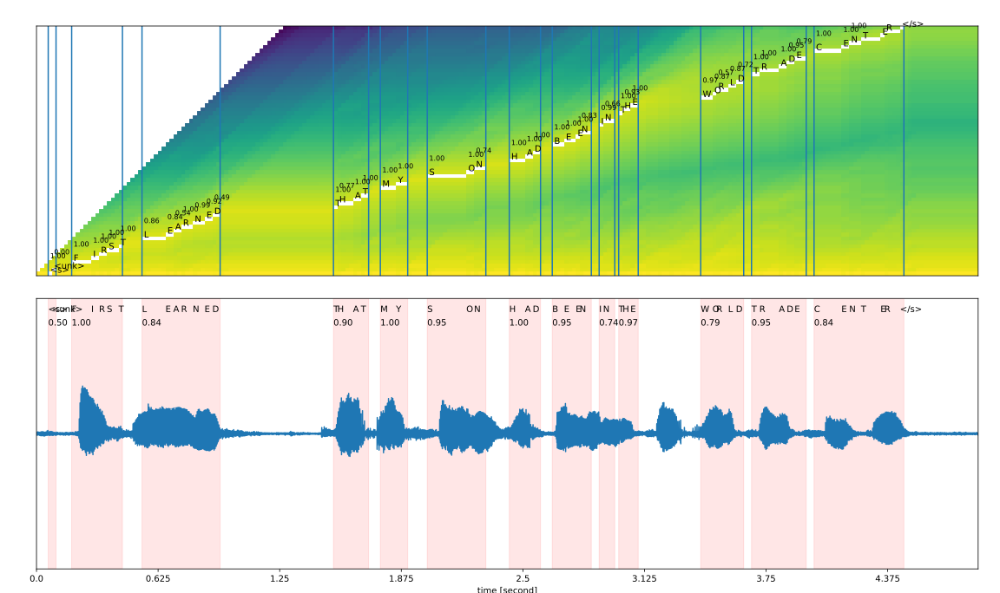

# Keyword Search in Audio with Adversarial Examples: Final Report
_Authors: Wassim Jabrane, Annabel Jakob, Szymon Ciciala_

The repository contains the code developed for the research conducted as part of the Machine Learning Practical course produced at the University of Edinburgh. 

## Abstract 

> The central goal of this research is to build an
end-to-end keyword recognition system that finds
spoken keywords within audio files. To this end,
we explore different approaches, from naive direct audio comparison to deep neural networks.
The keyword and target audio are first transcribed
and then compared for the deep neural network
approach. In addition, we investigate the testing performance of these models on adversarial examples (examples specifically crafted to
elicit a false response from the model). This
research also entails the generation of groundtruth timestamps of terms in a transcript to the
audio using forced alignment. During this project,
we were faced with numerous resource restrictions, mainly the computational intensity of automatic speech recognition. We find that neither the
naive comparison approach nor the deep learning
transcription approach leads to acceptable performance. We thus conclude that specifically trained
> automatic speech recognition and language models are required to improve performance.

The main innovation for the project is to investigate the performances of the developed models on adversarial examples, using two datasets: The **TED Talk (TEDLIUM-3)** dataset and the **Multilingual Spoken Words (MSWC)** dataset.  The model developed is a first step in allowing, for instance, investigators to efficiently search evidence such as dash-cam footage and recorded conversations and improve the robustness of the model against tampered evidence. 

## Model Pipeline 

## Full Report

For more details about the workings of the project and the results, please refer to the
[Research Report](./FinalReport/MLP_Group_043_FinalReport.pdf).

## Code Setup
Please run `python3 setup.py develop` on the root folder to build packages. (_TBD_: Needs more work, currently just recognised src as package)

## Methodology 
Here are the main methods used in this research:
CTC loss, Long Short-Term Memory models, Mel Frequency Cepstral Coefficients, and the word-error rate

• **CTC-Loss**: Connectionist Temporal Classification
(CTC) is a loss function used for training automatic
speech recognition (ASR) neural networks. It solves
the issue of not knowing how the characters in a
transcript align to the audio (Hannun, 2017). Given an
input sequence X (e.g., audio) and an output sequence
Y (e.g., transcript), the CTC algorithm computes
an output distribution over all Y and we infer that
the Y with the maximum likelihood is likely correct
(Hannun, 2017).

• **Long Short-Term Memory (LSTM)** models: For
the third approach to keyword identification, we use
a Long Short-Term Memory (LSTM) model. LSTMs
are a type of recurrent neural network, making them
suitable for learning from sequential data (Hochreiter
& Schmidhuber, 1997).

• **Mel Frequency Cepstral Coefficient**: A method to
extract features from audio. Sounds produced
by humans depend on the shape of one’s vocal tract. MFCC features represent units of sound as such shapes.

• **Word Error Rate**: Industry standard for measuring model accuracy. The WER counts the
number of incorrect words identified during recognition and divides by the total number of words provided
in a ground-truth transcript. The WER is defined
by Equation 3, where I indicates the incorrectly added
words, D indicates the terms not occurring in the transcript returned by the model, and S indicates words
that are substituted between reference and hypothesis.

 ## Ideal CTC loss Encoder/Decoder structure.
Trained end to end the encoder and decoder structure allows us to input audio
and output characters. Here in the model H: depicts the encoded
sequence, C: acts as the context vector which stores temporal
information. AC: are our attention context activation taking in
a little content from the past and applying it to the present and
future. SOS: and EOS: stand for start of sequence and end of
sequence. The idea inspired by the LAS architecture (Chan et al.,
2015b) is similar to compression in reasoning. This is where we
take an audio segments, encode it into a smaller form reducing its
dimensional then expand it back into character sequences. These
character sequences act as buckets that output a confidence of
what character is being said in a given time frame T.

 ## Wav2Vec - Timestamp Visualisation through Forced Alignment Method
The figure shows the visualisation of the trellis matrix in the top plot and the audio wave signal in the bottom plot. The
characters are also displayed in the trellis matrix, representing at which estimated time it was found of one audio clip. The audio plot
contains the joined words, with the red background demonstrating the span of a given word. The numbers above the characters and
joined words represent the confidence score of the Wav2Vec2 model.

.

